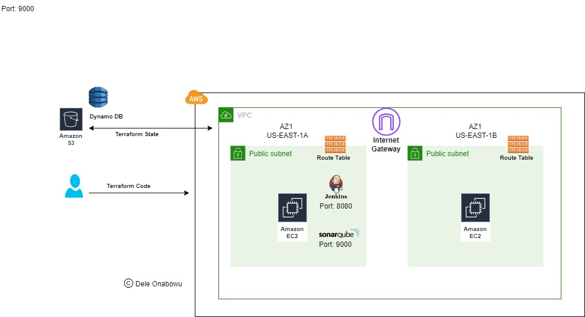
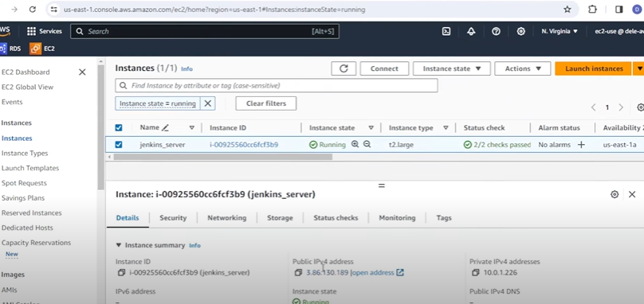
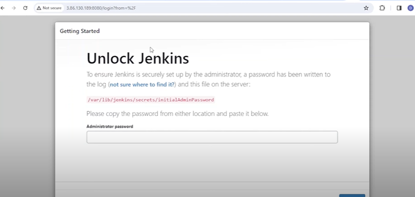
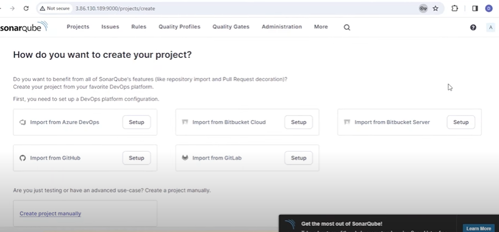
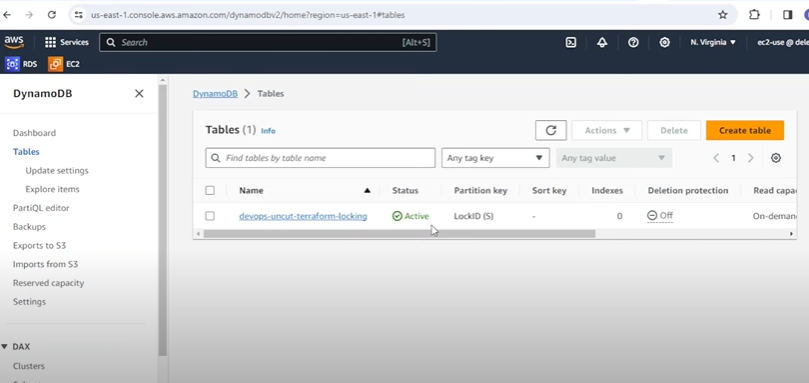
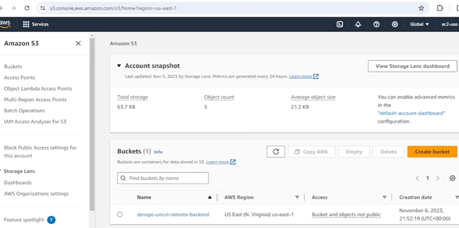

HOW TO STORE OUR TERRAFORM STATE FOR OUR INFRASTRUCTURE IN A REMOTE BACKEND
----------------------------


Prerequisites
1. AWS account
2. A Terraform Project - Terraform code to build infrastructure in AWS
3. Terraform installed on your local machine
4. AWS CLI installed and configured on your local machine

To learn how to install and configure AWS CLI, please watch one of my videos dedicated to this
Video url: https://www.youtube.com/watch?v=GW34S7mQZ2A&t=22s


QUICK BACKGROUND ABOUT TERRAFORM STATE


IDEMPOTENCY IN TERRAFORM


DESIRED STATE VS CURRENT STATE

In summary, the desired state is the high-level definition of how your infrastructure should be configured, while the current state is the actual, observed state of the infrastructure as it exists in reality. IaC tools like Terraform work to reconcile the two, making changes as necessary to bring the current state in line with the declared desired state. 


WHY STORE YOUR STATE IN A REMOTE BACKEND? 
-------------------------------------------

  COLLABORATION: 

  LOCKING MECHANISMS:   

  DATA SEPARATION: 
  
  DATA CONSISTENCY: A remote backend ensures that the state file is consistently accessible and up to date. It minimizes the risk of issues that can occur when state files are lost, corrupted, or outdated.
  
  SECURE STORAGE: 
  
  VERSIONING: 
  
  SCALABILITY: 
  
  INTEGRATION WITH CI/CD PIPELINES: 


OUR INFRASTRUCTURE
------------------
1. VPC
2. 2 PUBLIC SUBNETS
3. Internet Gateway 
4. Route table and route
5. Route Table Associations for each subnet
6. An EC2 Instance / Virtual Machine
- Automatically install:
Jenkins CI 
SonarQube - Code Analysis and Scanning
Docker
Terraform 
Kubectl
Git Maven

- We shall test that Jenkins has been installed http://publicip:8080
- We shall test that SonaQube has been Installed http://publicip:9000


#######  WE SHALL CHECK OUT STATEFILE AND SEE THAT IT IS HOSTED LOCALLY

#######  CHANGE FROM LOCAL TO REMOTE BACKEND

- Edit our configuration to store our state file remotely i.e remote backend

- Apply our new architecture to verify that it is still working.

- We shall test that Jenkins has been installed http://publicip:8080
- We shall test that SonaQube has been Installed http://publicip:9000

### Let's begin by setting our provider and terrafom version

```
touch provider.tf
```
### provider is AWS
### region is us-east-1 set in terraform.tfvars
```
provider "aws" {
  region = var.region
}

terraform {
  required_version = ">= 1.0"

  required_providers {
    aws = {
      source  = "hashicorp/aws"
      version = ">= 5.0"
    }
  }
}
```


### CREATE  THE VPC AND NEWTWORKING- VPC 2 SUBNETS, INTERNET GATEWAY AND ROUTE TABLES ###
### Create file networking.tf
```
touch networking.tf
```
### Insert the following int0 networking.tf

```
### Create VPC
resource "aws_vpc" "devops_uncut_vpc" {
  cidr_block = var.vpc_cidr
  tags = {
    Name = "${var.environ}-devops_uncut_vpc"
    
  }
}

### Create 2 public subnets

resource "aws_subnet" "public_subnet1" {
  vpc_id     = aws_vpc.devops_uncut_vpc.id 
  cidr_block = var.public_subnet1_cidr
  availability_zone = var.az1
  map_public_ip_on_launch = true

  tags = {
    Name = "${var.environ}-public_subnet1"
    
  }
}

resource "aws_subnet" "public_subnet2" {
  vpc_id     = aws_vpc.devops_uncut_vpc.id 
  cidr_block = var.public_subnet2_cidr
  availability_zone = var.az2
  map_public_ip_on_launch = true

  tags = {
    Name = "${var.environ}-public_subnet2"
    "kubernetes.io/cluster/my-eks-cluster" = "shared"
    "kubernetes.io/role/internal-elb"         = 1
  }
}


### Create Internet Gateway

resource "aws_internet_gateway" "igw" {
  vpc_id = aws_vpc.devops_uncut_vpc.id

  tags = {
    Name = "${var.environ}-igw"
  }
}

### Create route table

resource "aws_route_table" "public-rt" {
  vpc_id = aws_vpc.devops_uncut_vpc.id
  route {
    cidr_block = "0.0.0.0/0"
    gateway_id = aws_internet_gateway.igw.id
  }
  tags = {
    Name = "${var.environ}-public-rt"
  }
}
### create route table associations for both subnets
resource "aws_route_table_association" "public_rt_association1" {
    subnet_id = aws_subnet.public_subnet1.id
    route_table_id = aws_route_table.public-rt.id
  
}

resource "aws_route_table_association" "public_rt_association2" {
    subnet_id = aws_subnet.public_subnet2.id
    route_table_id = aws_route_table.public-rt.id
  
}

```
### Let's create our ec2 instance (jenkins_server)
### We shall use a userdata shell script to install Terraform,
Docker, Maven, Kubectl, Trivy and SonarQube needed by the CICD team.

```
touch jenkins.tf
```
### Insert the following into jenkins.tf


### This data store is holding the most recent ubuntu 20.04 image
```
data "aws_ami" "ubuntu" {
   most_recent = "true"

   filter {
      name = "name"
      values = ["ubuntu/images/hvm-ssd/ubuntu-focal-20.04-amd64-server-*"]
   }

   filter {
      name = "virtualization-type"
      values = ["hvm"]
   }

   owners = ["099720109477"]
}

data "aws_key_pair" "existing_key_pair" {
  key_name = "my-ec2-keypair"  # Replace with the name of your existing key pair
}
```
### Creating an EC2 instance called jenkins_server
```
resource "aws_instance" "jenkins_server" {
   ### Setting the AMI to the ID of the Ubuntu 20.04 AMI from the data store
   ami = data.aws_ami.ubuntu.id

   ### Setting the subnet to the public subnet we created
   subnet_id = aws_subnet.public_subnet1.id
   ### Setting the instance type to t2.micro
   instance_type = "t2.large"
  associate_public_ip_address = true
   ### Setting the security group to the security group we created
   vpc_security_group_ids = [aws_security_group.my_instance_SG.id]

   ## Setting the key pair name to the key pair we created
   key_name = data.aws_key_pair.existing_key_pair.key_name

   ## Setting the user data to the bash file called install_jenkins.sh
   user_data = file("jenkins.sh")

   ## Setting the Name tag to jenkins_server
   tags = {
      Name = "jenkins_server"
   }
}
```
### Creating an Elastic IP called jenkins_eip to assign to our jenkins_server instance
### This ensures that the public ip doesn't change if the instance is stopped and restarted.

```
resource "aws_eip" "jenkins_eip" {
   ### Attaching it to the jenkins_server EC2 instance
  instance = aws_instance.jenkins_server.id

  
   ### Setting the tag Name to jenkins_eip
   tags = {
     # Name = "jenkins_eip"
   }
}

```

### Let's create the userdata script (jenkins.sh) for our instance

```
touch jenkins.sh
```

### Paste into jenkins.sh

```
#!/bin/bash
# Install Jenkins
sudo apt-get update
sudo wget -O /usr/share/keyrings/jenkins-keyring.asc \
    https://pkg.jenkins.io/debian/jenkins.io-2023.key
echo deb [signed-by=/usr/share/keyrings/jenkins-keyring.asc] \
    https://pkg.jenkins.io/debian binary/ | sudo tee \
    /etc/apt/sources.list.d/jenkins.list > /dev/null

sudo apt-get update
sudo apt-get install fontconfig openjdk-17-jre -y
sudo apt-get install jenkins -y

# Install git
sudo apt-get update
sudo apt-get install git

# Install Terraform
sudo apt-get update && sudo apt-get install -y gnupg software-properties-common

wget -O- https://apt.releases.hashicorp.com/gpg | \
gpg --dearmor | \
sudo tee /usr/share/keyrings/hashicorp-archive-keyring.gpg

gpg --no-default-keyring \
--keyring /usr/share/keyrings/hashicorp-archive-keyring.gpg \
--fingerprint

echo "deb [signed-by=/usr/share/keyrings/hashicorp-archive-keyring.gpg] \
https://apt.releases.hashicorp.com $(lsb_release -cs) main" | \
sudo tee /etc/apt/sources.list.d/hashicorp.list

sudo apt update

sudo apt-get install terraform 

# Install Kubectl

sudo curl -LO https://dl.k8s.io/release/v1.28.3/bin/linux/amd64/kubectl
sudo chmod +x kubectl
sudo mkdir -p $HOME/bin
sudo cp ./kubectl $HOME/bin/kubectl
export PATH=$PATH:$HOME/bin

# Install Maven
# sudo apt install maven -y
wget https://mirrors.estointernet.in/apache/maven/maven-3/3.6.3/binaries/apache-maven-3.6.3-bin.tar.gz
tar -xvf apache-maven-3.6.3-bin.tar.gz
mv apache-maven-3.6.3 /opt/
M2_HOME='/opt/apache-maven-3.6.3'
PATH="$M2_HOME/bin:$PATH"
export PATH


# Install Docker

sudo apt install apt-transport-https ca-certificates curl software-properties-common -y

curl -fsSL https://download.docker.com/linux/ubuntu/gpg | sudo apt-key add -

sudo add-apt-repository "deb [arch=amd64] https://download.docker.com/linux/ubuntu bionic stable" -y

sudo apt update -y

apt-cache policy docker-ce -y

sudo apt install docker-ce -y

#sudo systemctl status docker
### This added to ensure our container runs
sudo chmod 777 /var/run/docker.sock


#Install Sonarqube

sudo docker run -d --name sonarqube -p 9000:9000 -p 9092:9092 sonarqube

#Install Trivy

sudo apt-get install wget apt-transport-https gnupg lsb-release
wget -qO - https://aquasecurity.github.io/trivy-repo/deb/public.key | sudo apt-key add -
echo deb https://aquasecurity.github.io/trivy-repo/deb $(lsb_release -sc) main | sudo tee -a /etc/apt/sources.list.d/trivy.list
sudo apt-get update -y
sudo apt-get install trivy -y

```

### Create the Instance security group jenkins-sg.tf

```
jenkins-sg.tf
```

### Paste the code in jenkins-sg.tf

```
resource "aws_security_group" "my_instance_SG" {
  name_prefix = "lesson3-"
vpc_id = aws_vpc.devops_uncut_vpc.id
tags = {
    Name = "${var.environ}-jenkins-sg"
  }
}

# Allow incoming HTTP (port 80) traffic
resource "aws_security_group_rule" "http_inbound" {
  type        = "ingress"
  from_port   = 80
  to_port     = 80
  protocol    = "tcp"
  cidr_blocks = ["0.0.0.0/0"]

  security_group_id = aws_security_group.my_instance_SG.id
}

# Allow incoming HTTP (port 80) traffic
resource "aws_security_group_rule" "sonarqube_inbound" {
  type        = "ingress"
  from_port   = 9000
  to_port     = 9000
  protocol    = "tcp"
  cidr_blocks = ["0.0.0.0/0"]

  security_group_id = aws_security_group.my_instance_SG.id
}

# Allow incoming SSH (port 22) traffic
resource "aws_security_group_rule" "ssh_inbound" {
  type        = "ingress"
  from_port   = 22
  to_port     = 22
  protocol    = "tcp"
  cidr_blocks = ["0.0.0.0/0"]
  security_group_id = aws_security_group.my_instance_SG.id
}

# Allow incoming (port 8080) traffic for Jenkins
resource "aws_security_group_rule" "jenkins_inbound" {
  type        = "ingress"
  from_port   = 8080
  to_port     = 8080
  protocol    = "tcp"
  cidr_blocks = ["0.0.0.0/0"]

  security_group_id = aws_security_group.my_instance_SG.id
}

resource "aws_security_group_rule" "downloads" {
  type        = "egress"
  from_port   = 0
  to_port     = 0
  protocol    = "-1"
  cidr_blocks = ["0.0.0.0/0"]

  security_group_id = aws_security_group.my_instance_SG.id
}

```

### All our variables are declared in variables.tf and values set in terraform.tfvars

```
touch variables.tf
```

```
variable "region" {}
variable "vpc_cidr" {}
variable "public_subnet1_cidr" {}
variable "public_subnet2_cidr" {}
variable "private_subnet1_cidr" {}
variable "private_subnet2_cidr" {}
variable "az1" {}
variable "az2" {}
variable "environ" {}

```

```
touch terraform.tfvars
```

```
region ="us-east-1"
vpc_cidr ="10.0.0.0/16"
public_subnet1_cidr="10.0.1.0/24"
public_subnet2_cidr="10.0.2.0/24"
private_subnet1_cidr="10.0.3.0/24"
private_subnet2_cidr="10.0.4.0/24"
az1="us-east-1a"
az2="us-east-1b"
environ = "staging"

```

### For quick access, let's output our server public ip and our elastic ip's ip

```
output "jenkins-public-ip" {
  value = aws_instance.jenkins_server.public_ip
}

output "jenkins_eip" {
  value = aws_eip.jenkins_eip.public_ip
}


```

Let's provision our infrastructure

```
terraform init
```
```
terraform plan
```

```
terraform apply
```

### Log into the AWS Console and retrive the public IP of our jenkins server



### Go to the browser and check our jenkins and SonarQube Installations





### Our installation is successful
### Let's destroy our infrastructure 

```
terraform destroy -auto-approve
```

### Infrastructure destroyed


### We are now going to update our configuration to use a remote backend instead od the default local backend.


### Let's create a directory that will host the code to provision our S3 bucket and DynamoDB table

```
mkdir backend
```

Create provider.tf, backend.tf, variables.tf and terraform.tfvars in the backend directory

```
cd backend/
```
```
touch  provider.tf backend.tf variables.tf terraform.tfvars
```

### provider.tf

```
provider "aws" {
  region = var.region
}

terraform {
  required_version = ">= 1.0"

  required_providers {
    aws = {
      source  = "hashicorp/aws"
      version = ">= 5.0"
    }
  }
}
```

### backend.tf
### Create our S3 bucket, s3 bucket versioning resource, server side encryption by default resource and Dynamo DB table.
### backend.tf
```
resource "aws_s3_bucket" "devops-uncut-remote-backend" {
  bucket = var.s3_bucket_name
  force_destroy = true
}


resource "aws_s3_bucket_versioning" "bucket-versioning" {
  bucket = var.s3_bucket_name
  versioning_configuration {
    status = "Enabled"
  }
}

resource "aws_s3_bucket_server_side_encryption_configuration" "bucket-encrypt" {
  bucket = var.s3_bucket_name
  rule {
    apply_server_side_encryption_by_default {
      sse_algorithm = "AES256"
    }
  }
}

resource "aws_dynamodb_table" "terraform_locks" {
  name         = var.s3_dynamodb_name
  billing_mode = "PAY_PER_REQUEST"
  hash_key     = "LockID"
  attribute {
    name = "LockID"
    type = "S"
  }
}
```
### Let's create the remote backend

```
terraform init
```
```
terraform plan
```

```
terraform apply -auto-approve
```

### Log into the AWS console to see if out s3 bucket and dynamodb table have been created.

### Dynamo DB



### S3




### Now, we need to go to the configurations for our infrastructure and instruct terraform to use ae remote backend using the s3 and dynamo db table we created.

### go to your infrastructures provider.tf file
```
cd ..
```
```
cd create-jenkins-server-and-vpc
```
### open create-jenkins-server-and-vpc/provider.tf

### Add the terraform backend block and reference the created backend.
### It should now look as below
```
provider "aws" {
  region = var.region
}

terraform {
  required_version = ">= 1.0"

  required_providers {
    aws = {
      source  = "hashicorp/aws"
      version = ">= 5.0"
    }
  }
}

terraform {
  backend "s3" {
    bucket         = "devops-uncut-remote-backend"
    key            = "global/s3/terraform.tfstate"
    region         = "us-east-1"
    dynamodb_table = "devops-uncut-terraform-locking"
    encrypt        = true
  }
}
```
